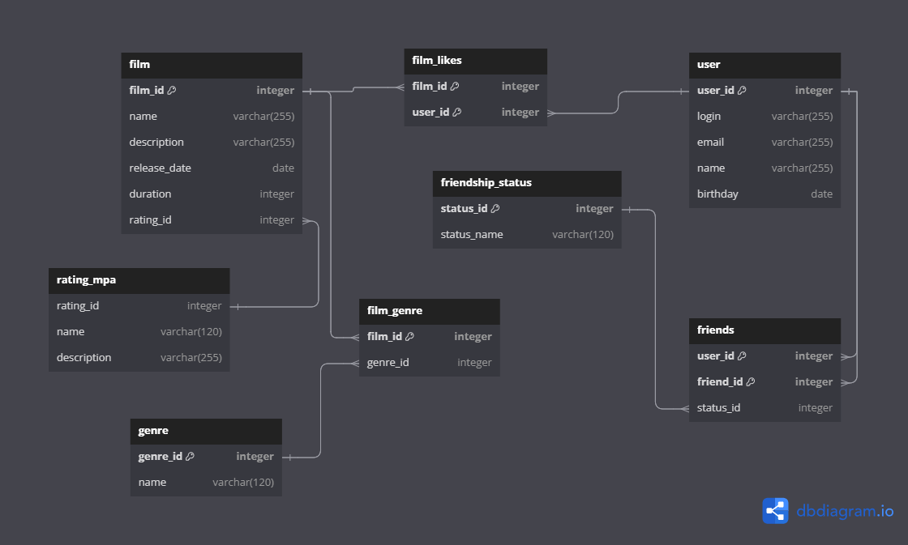

# [FILMORATE](https://github.com/Elena-Zhorzhevna/java-filmorate) 
###### Пэт проект в рамках учебной программы Яндекс.

Бэкенд для сервиса, который будет работать с фильмами и оценками пользователей, а также возвращать топ фильмов, рекомендованных к просмотру. 
Теперь ни вам, ни вашим друзьям не придётся долго размышлять, что посмотреть вечером.

1. [ER - diagram](#er-diagram)
2. [Description](#tables-description)

## ER diagram

## Tables Description

user

В таблице `user` хранится информация о пользователях приложения Filmorate.

| Column   | Type         | Constraints      | Notes                 |
|----------|--------------|------------------|-----------------------|
| user_id  | bigint       | PK               | unique identification |   
| login    | varchar(255) | not null, unique | user login            |
| email    | varchar(255) | not null, unique | user email            |
| name     | varchar(255) |                  | user name             |
| birthday | date         | not null         | user birthday         |

friendship

Таблица `friendship` отражает дружеские отношения между пользователями.

| Column    | Type    | Constraints      | Notes                                             |
|-----------|---------|------------------|---------------------------------------------------|
| user_id   | bigint  | PK, FK(user.id)  | part of composite PK, references user id          |   
| friend_id | bigint  | PK, FK(user.id)  | part of composite PK, references friend's user id |
| status_id | integer |                  | defines friendship_status                         |

friendship_status

Таблица `friendship_status` содержит статус дружбы между двумя пользователями.

| Column      | Type         | Constraints | Notes                            |
|-------------|--------------|-------------|----------------------------------|
| status_id   | integer      | PK          | unique identification            |   
| status_name | varchar(120) | not null    | status name                      |

| status_id | status_name    |
|-----------|----------------|
| 1         | unconfirmed    |
| 2         | confirmed      |

film

В таблице `film` хранится информация о фильмах, доступных в приложении.

| Column        | Type         | Constraints               | Notes                           |
|---------------|--------------|---------------------------|---------------------------------|
| film_id       | bigint       | PK                        | unique identification           |   
| name          | varchar(255) | not null                  | film name                       |
| description   | varchar(255) |                           | film description                |
| release_date  | date         | not null                  | film release date               |
| duration      | integer      |                           | film duration in minutes        |
| rating_id     | integer      | FK(rating_mpa.rating_id)  | references MPA rating ID        |

film_like

В таблице `film_like` представлены фильмы, которые получили лайк от пользователя. 
Определенный пользователь может поставить "лайк" определенному фильму только один раз.	

| Column  | Type    | Constraints           | Notes                                    |
|---------|---------|-----------------------|------------------------------------------|
| film_id | bigint  | PK, FK(films.film_id) | part of composite PK, references film id |
| user_id | bigint  | PK, FK(users.user.id) | part of composite PK, references user id | 

film_genre

Таблица `film_genre` позволяет установить соотношение "многие ко многим" между фильмами и жанрами.
Каждый фильм может быть связан с несколькими жанрами, а один жанр (из таблицы "film_genres") может быть связан с несколькими фильмами.

| Column   | Type    | Constraints             | Notes                                     |
|----------|---------|-------------------------|-------------------------------------------|
| film_id  | bigint  | PK, FK(films.film_id)   | part of composite PK, references film id  |   
| genre_id | integer | PK, FK(genres.genre_id) | part of composite PK, references genre id |

genre

В таблице `genre` перечислены жанры, к которым могут относиться фильмы.

| Column       | Type         | Constraints | Notes                           |
|--------------|--------------|-------------|---------------------------------|
| genre_id     | integer      | PK          | unique identification for genre |   
| name         | varchar(120) | not null    | genre name                      |

| genre_id | name           |
|----------|----------------|
| 1        | Комедия        |
| 2        | Драма          |
| 3        | Мультфильм     |
| 4        | Триллер        |
| 5        | Документальный |
| 6        | Боевик         |

rating_mpa

Таблица `rating_mpa` содержит различные рейтинги Ассоциации кинематографистов (MPA), которые могут быть присвоены фильмам,
с указанием соответствующих возрастных ограничений.

| Column      | Type         | Constraints | Notes                            |
|-------------|--------------|-------------|----------------------------------|
| rating_id   | integer      | PK          | unique identification for rating |   
| name        | varchar(120) | not null    | rating name                      |
| description | varchar(255) | not null    | rating description               |

| rating_id | name  | description                                     |                                              
|-----------|-------|-------------------------------------------------|
| 1         | G     | нет возрастных ограничений                      |                                             
| 2         | PG    | детям рекомендуется смотреть фильм с родителями |      
| 3         | PG-13 | детям до 13 лет просмотр не желателен           |                
| 4         | R     | лицам до 17 лет только в присутствии взрослого  | 
| 5         | NC-17 | лицам до 18 лет просмотр запрещён               |

